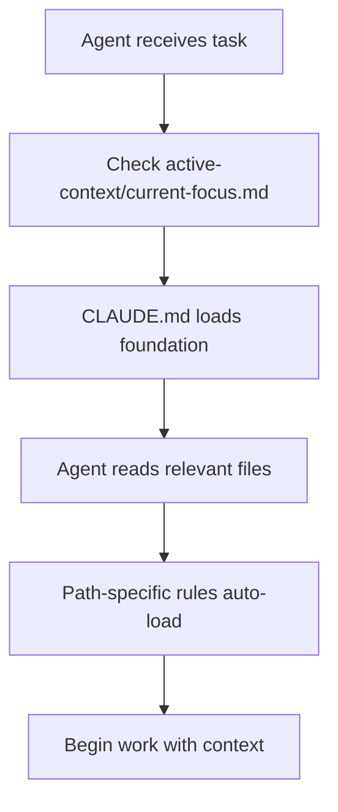
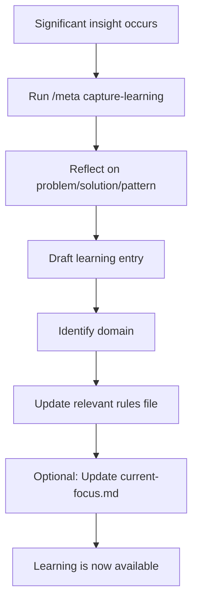

# Thoughtbox Memory System Design

**Created**: 2026-01-09  
**Purpose**: Learning memory system that improves information topology over time

---

## Executive Summary

This document describes the **progressive learning memory system** implemented for the Thoughtbox codebase. The system enables Claude agents (Agent SDK, Claude Code CLI) to:

1. **Learn from past work** through structured memory capture
2. **Access relevant information contextually** via path-specific rules
3. **Improve information topology over time** as patterns emerge
4. **Maintain fresh, actionable knowledge** through temporal decay

**Core Principle**: Make salient information "ready at hand" - the right information, at the right time, in the right place.

---

## Design Goals

### 1. Progressive Learning
- Memory improves incrementally through agent interactions
- Patterns emerge and crystallize over time
- Recent learnings prioritized over stale information

### 2. Contextual Discovery
- Information appears when relevant (path-specific rules)
- Hierarchical scoping (project → domain → file-specific)
- Automatic loading reduces cognitive overhead

### 3. Low Friction Capture
- Easy to add learnings during work sessions
- Standard templates and formats
- Integrated into workflow, not separate process

### 4. Temporal Awareness
- Recent insights marked as "hot" (high priority)
- Older stable patterns marked as "cold" (reference)
- Decay and archival prevent information overload

---

## Architecture

### Memory Hierarchy

```
┌─────────────────────────────────────────────────────────────┐
│  CLAUDE.md                                                   │
│  Entry point, router to specialized memory                  │
│  Loaded: Always                                             │
└────────────────────────┬────────────────────────────────────┘
                         │
          ┌──────────────┼──────────────┐
          │              │              │
┌─────────▼─────────┐  ┌─▼──────────┐  ┌▼─────────────────┐
│   AGENTS.md        │  │ .claude/   │  │ active-context/  │
│   Foundation       │  │ rules/     │  │ current-focus    │
│   Architecture     │  │ Domain     │  │ Current work     │
│   Conventions      │  │ Specific   │  │ Recent decisions │
└────────────────────┘  └─┬──────────┘  └──────────────────┘
                          │
          ┌───────────────┼───────────────┐
          │               │               │
    ┌─────▼─────┐  ┌──────▼──────┐  ┌────▼────┐
    │ tools/    │  │ infra-      │  │ lessons/│
    │ thoughtbox│  │ structure/  │  │ 2026-01-│
    │ notebook  │  │ firebase    │  │ topic   │
    │ mental-   │  │ middleware  │  │ ...     │
    │ models    │  │ deployment  │  │         │
    └───────────┘  └─────────────┘  └─────────┘
```

### Directory Structure

```
.claude/
├── rules/
│   ├── 00-meta.md                      # Memory system guide
│   ├── TEMPLATE.md                     # Template for new rules
│   │
│   ├── tools/                          # Tool-specific patterns
│   │   ├── thoughtbox.md              [paths: src/index.ts, src/thought-handler.ts]
│   │   ├── notebook.md                [paths: src/notebook/**]
│   │   └── mental-models.md           [paths: src/mental-models/**]
│   │
│   ├── infrastructure/                 # System-level patterns
│   │   ├── firebase.md                [paths: src/firebase.ts, src/persistence/firestore.ts]
│   │   ├── middleware.md              [paths: src/middleware/**]
│   │   └── deployment.md              [paths: Dockerfile, cloudbuild.yaml]
│   │
│   ├── testing/                        # Testing conventions
│   │   └── behavioral-tests.md        [paths: tests/**, scripts/agentic-test.ts]
│   │
│   ├── lessons/                        # Cross-cutting learnings
│   │   └── 2026-01-version-control-safety.md
│   │
│   └── active-context/                 # Current work state
│       └── current-focus.md
│
└── commands/
    └── meta/
        └── capture-learning.md         # Workflow for capturing learnings
```

---

## Key Mechanisms

### 1. Path-Specific Auto-Loading

**Mechanism**: YAML frontmatter in rules files
```markdown
---
paths: [src/notebook/**/*.ts, src/notebook/**/*.js]
---
# Notebook Tool Memory
...
```

**Behavior**: When agent reads/writes files matching these paths, Claude Code automatically loads this rule file into context.

**Benefit**: Relevant information appears without explicit imports.

### 2. Temporal Freshness System

**Tags**:
- 🔥 **HOT** (< 2 weeks): Current active work, highest priority
- ⚡ **WARM** (< 3 months): Recent patterns, very relevant
- 📚 **COLD** (> 3 months): Stable knowledge, reference as needed
- 🗄️ **ARCHIVED** (> 6 months): Historical, moved to `ai_docs/archive/`

**Benefit**: Agents prioritize recent learnings, stale info doesn't clutter context.

### 3. Structured Learning Capture

**Standard Format**:
```markdown
### YYYY-MM-DD: [Brief Title] 🔥
- **Issue**: What was the problem
- **Solution**: What worked (specifics)
- **Files**: Key files with line ranges
- **Pattern**: Reusable principle
- **See Also**: Cross-references
```

**Benefit**: Consistent structure enables quick scanning, pattern recognition.

### 4. Memory Lifecycle

```
┌─────────────┐
│  Capture    │  During/after work session
│  (Hot 🔥)   │  Add to domain-specific rules file
└─────┬───────┘
      │
      ▼
┌─────────────┐
│ Consolidate │  Weekly/monthly review
│  (Warm ⚡)  │  Integrate recurring patterns
└─────┬───────┘
      │
      ▼
┌─────────────┐
│  Stabilize  │  Patterns become "cold" stable knowledge
│  (Cold 📚)  │  Move to "Core Patterns" section
└─────┬───────┘
      │
      ▼
┌─────────────┐
│   Archive   │  Quarterly cleanup
│ (Archived)  │  Move to ai_docs/archive/
└─────────────┘
```

---

## Information Topology Principles

### 1. Proximity Principle
**Definition**: Information should be near where it's used.

**Implementation**:
- Path-specific rules load when working on matching files
- Domain organization mirrors codebase structure
- Related concepts cross-referenced

**Example**: Editing `src/firebase.ts` auto-loads `.claude/rules/infrastructure/firebase.md`

### 2. Specificity Hierarchy
**Definition**: More specific information overrides general.

**Implementation**:
```
Highest Priority:
├─ Path-specific rules (e.g., tools/thoughtbox.md)
├─ Recent lessons (e.g., lessons/2026-01-topic.md)
├─ Active context (e.g., active-context/current-focus.md)
├─ Domain rules (e.g., infrastructure/firebase.md)
└─ Foundation (AGENTS.md)
Lowest Priority
```

### 3. Recency Bias
**Definition**: Recent information is prioritized.

**Implementation**:
- Entries sorted newest-first
- Temporal tags (🔥⚡📚🗄️)
- "Recent Learnings" section at top of files

### 4. Actionability Over Description
**Definition**: Capture patterns, not just facts.

**Implementation**:
- "Pattern" field in learning format
- "Common Pitfalls" with ❌/✅ examples
- "Quick Reference" for immediate use

---

## Workflows

### Agent Starting a Task



**What's loaded**:
1. `CLAUDE.md` (entry point)
2. `AGENTS.md` (foundation)
3. `active-context/current-focus.md` (current state)
4. Path-specific rules (automatic)

### Agent Capturing Learning



**Result**: Next agent working in that domain will have this knowledge.

### Memory Maintenance (Periodic)

**Weekly**:
- Review `lessons/` directory
- Integrate recurring patterns into domain rules
- Update `active-context/current-focus.md`

**Monthly**:
- Update freshness tags (🔥 → ⚡ → 📚)
- Consolidate similar learnings
- Archive deprecated information

**Quarterly**:
- Move >6 month learnings to `ai_docs/archive/`
- Major reorganization if structure isn't working
- Update `00-meta.md` with system improvements

---

## Practical Examples

### Example 1: Firebase Connection Issue

**Scenario**: Agent encounters Firestore initialization error.

**Discovery Path**:
1. Agent reads `src/firebase.ts` (matches path)
2. `.claude/rules/infrastructure/firebase.md` auto-loads
3. Agent sees "Common Pitfalls" → "Private Key Newline Handling"
4. Applies fix immediately

**Outcome**: Problem solved in seconds, not minutes of debugging.

### Example 2: Writing New Tool

**Scenario**: Agent needs to implement new MCP tool.

**Discovery Path**:
1. Agent checks `active-context/current-focus.md` (not current focus)
2. Agent opens `AGENTS.md` → "Adding New Functionality" → "New Tool"
3. Agent examines `src/index.ts` (tool registration)
4. `.claude/rules/tools/thoughtbox.md` auto-loads (similar pattern)
5. Agent sees "Tool Registration Location" and Zod schema patterns

**Outcome**: Tool implemented following established patterns.

### Example 3: Test Failure

**Scenario**: Behavioral test fails unexpectedly.

**Discovery Path**:
1. Agent runs test, sees failure
2. Checks `reports/behavioral_execution_report_*.md`
3. Opens `.claude/rules/testing/behavioral-tests.md` (debugging section)
4. Sees "Common Failure Patterns" → matches issue
5. Applies solution from previous similar failure

**Outcome**: Test fixed using accumulated knowledge.

---

## Integration with Claude Code Features

### Memory (`/memory` command)

Shows currently loaded memory files:
```
Loaded memory:
- CLAUDE.md
- AGENTS.md
- .claude/rules/tools/thoughtbox.md (path: src/index.ts)
- .claude/rules/active-context/current-focus.md
```

### Config (`/config` command)

Configure memory behavior:
- Which scopes are active
- Path-specific rule loading
- Memory file locations

### Commands (`/meta capture-learning`)

Structured workflow for capturing learnings:
- Reflection prompts
- Template generation
- File selection guidance

### Hooks (Session lifecycle)

**session_start.sh**: Log session beginning, load current-focus

**post_tool_use.sh**: Detect patterns, suggest memory updates

**session_stop.sh**: Prompt for learning capture (future)

---

## Success Metrics

### Quantitative

1. **Discovery Time**: How long to find relevant information
   - Baseline: 2-5 minutes searching codebase/docs
   - Target: < 30 seconds via path-specific rules

2. **Repeated Mistakes**: Same issue encountered multiple times
   - Baseline: 3-5 repeats of common issues (observed)
   - Target: 0-1 repeats (captured in memory)

3. **Ramp-Up Time**: New agent (or context window) getting productive
   - Baseline: 10-20 minutes understanding codebase
   - Target: 2-5 minutes with memory system

4. **Memory Staleness**: Age of information in rules files
   - Track: Percentage of entries < 3 months old
   - Target: > 60% warm or hot

### Qualitative

1. **Relevance**: Right information at right time?
   - Agents report: "I found what I needed when I needed it"

2. **Actionability**: Can agents apply learnings immediately?
   - Patterns are specific enough to use directly

3. **Discoverability**: Can agents find information without help?
   - Structure is intuitive, cross-references work

4. **Evolution**: Is memory improving over time?
   - New patterns captured regularly
   - Old patterns consolidated/archived

---

## Comparison to Alternatives

### vs. Traditional Documentation

| Traditional Docs | Memory System |
|------------------|---------------|
| Static, separate from code | Embedded, path-specific |
| Comprehensive but not contextual | Contextual but may be incomplete |
| Manual search required | Auto-loaded by file path |
| Rarely updated | Living, evolves with work |
| One-size-fits-all | Hierarchical specificity |

**When to use each**:
- **Docs**: Deep conceptual understanding, onboarding
- **Memory**: Quick patterns, recent learnings, context

### vs. Code Comments

| Code Comments | Memory System |
|---------------|---------------|
| Inline with code | Separate but linked |
| File-specific | Cross-file patterns |
| Implementation details | Higher-level patterns |
| Can become stale | Explicitly dated |

**Synergy**: Comments explain "why", memory explains "pattern".

### vs. Git History

| Git History | Memory System |
|-------------|---------------|
| Complete but verbose | Curated highlights |
| Chronological commits | Thematic organization |
| Requires archaeology | Ready-to-use |
| Shows what changed | Shows what to remember |

**Synergy**: Memory references git commits for details.

---

## Future Enhancements

### Short-Term (Next 1-3 Months)

1. **Automated Learning Prompts**
   - Hook at session end: "What did we learn?"
   - Agent drafts memory entry automatically

2. **Memory Search Tool**
   - MCP tool: `search_memory(query: string)`
   - Semantic search across rules files

3. **Usage Analytics**
   - Track which rules are loaded most often
   - Identify gaps (frequent work without rules)

### Medium-Term (3-6 Months)

4. **Memory Visualization**
   - Graph view of learning connections
   - Temporal view of knowledge evolution

5. **Collaborative Memory**
   - Multiple agents contribute to same memory
   - Voting/validation on learnings

6. **Smart Consolidation**
   - Agent analyzes lessons/, suggests consolidation
   - Detects redundant or conflicting patterns

### Long-Term (6-12 Months)

7. **Memory Synthesis**
   - Agent generates "meta-patterns" from multiple learnings
   - Automatic archival of stable knowledge

8. **Cross-Project Memory**
   - Shared rules across related projects
   - User-level patterns reusable everywhere

9. **Memory Quality Metrics**
   - Track how often learnings are referenced
   - Deprecate unused patterns

---

## Lessons from Implementation

### What Worked Well

1. **Path-Specific Rules**
   - Auto-loading is magical, reduces cognitive load
   - Agents find information without thinking about it

2. **Standard Learning Format**
   - Consistency makes scanning easy
   - Issue/Solution/Pattern trifecta captures essence

3. **Temporal Tags**
   - Freshness indicators set expectations
   - Prevents over-reliance on stale info

4. **Active Context File**
   - Single source of truth for "what's happening now"
   - Prevents duplicate work

### What Needed Iteration

1. **Granularity**
   - Initial: One file per tool (too coarse for complex tools)
   - Revised: Subdirectories for large domains

2. **Update Friction**
   - Initial: Freeform, inconsistent updates
   - Revised: `/meta capture-learning` workflow

3. **Discovery**
   - Initial: Not obvious what rules exist
   - Revised: CLAUDE.md as router, explicit catalog

### Open Questions

1. **Optimal Memory Size**
   - How much information is too much?
   - When does context window get cluttered?

2. **Conflicting Patterns**
   - What if two learnings contradict?
   - How to handle "it depends" scenarios?

3. **Multi-Agent Consistency**
   - Different agents might learn different patterns
   - How to validate/consolidate?

---

## Getting Started

### For New Developers

1. Read `CLAUDE.md` (entry point)
2. Read `AGENTS.md` (foundation)
3. Skim `.claude/rules/00-meta.md` (system guide)
4. Browse domain rules relevant to your work
5. Use `/memory` to see what's loaded

### For Agents (New Context Window)

1. CLAUDE.md loads automatically
2. Check `active-context/current-focus.md` first
3. Path-specific rules load as you work
4. When stuck, check `lessons/` for similar issues
5. When done, capture learnings with `/meta capture-learning`

### For Maintainers

1. Weekly: Review new learnings in rules files
2. Monthly: Update freshness tags, consolidate patterns
3. Quarterly: Archive old learnings, reorganize if needed
4. Continuously: Improve `00-meta.md` as system evolves

---

## Conclusion

The Thoughtbox Memory System is an **experiment in progressive learning** for AI agents. It treats codebase knowledge as:

- **Living**: Continuously updated, not static
- **Contextual**: Right information, right time, right place
- **Temporal**: Recent insights prioritized
- **Actionable**: Patterns, not just facts

**Success means**: Agents get smarter over time. Mistakes aren't repeated. Patterns are discovered and reused. Information topology improves.

**The goal**: Make salient information always "ready at hand" 🎯

---

**References**:
- Claude Code Memory Docs: https://code.claude.com/docs/en/memory
- Implementation: `.claude/rules/` directory
- Entry Point: `CLAUDE.md`
- System Guide: `.claude/rules/00-meta.md`

**Created**: 2026-01-09  
**Authors**: Thoughtbox team + Claude  
**Status**: Initial implementation, evolving
